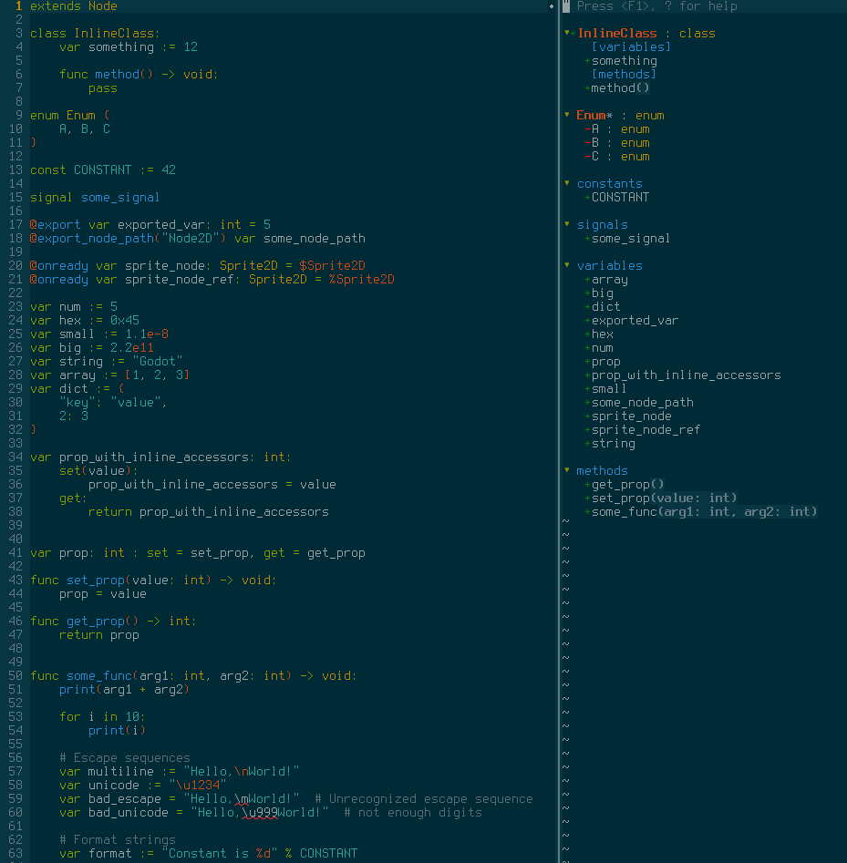

# Description
GDScript is the primary scripting language used by the [Godot Game Engine](https://godotengine.org/).

This plugin adds syntax highlighting and completion for the most recent version (3.0 at the time of writing).

# Installation
Using [vim-plug](https://github.com/junegunn/vim-plug):

    Plug 'calviken/vim-gdscript3'
    
Or any other plugin manager of your choice.

# Screenshot


*Colorscheme: [base16-eighties](https://github.com/chriskempson/base16-vim)*

# Completion
(Note: this feature requires Vim to be compiled with Python support)

Vim's completion feature can be used to display members and methods of built-in GDScript types (among other things).

To show completions, press `<C-x><C-o>` in insert mode, and use `<C-n>` and `<C-p>` to cycle through completions.

Alternatively, install a completion plugin (recommended). The following plugins are supported out of the box:

1. [SuperTab](https://github.com/ervandew/supertab): Shows completions when Tab is pressed.
2. [Deoplete](https://github.com/Shougo/deoplete.nvim): Asynchronous completion framework that shows completions as you type. 
2. [coc.nvim](https://github.com/neoclide/coc.nvim): Intellisense engine for vim8 & neovim, full language server protocol support as VSCode. 

Any plugin that supports omnicompletion should also work, but will likely require additional configuration.

[echodoc](https://github.com/Shougo/echodoc.vim) is also supported, for showing method signatures in the echo area (useful for methods with lots of parameters).

For a non-comprehensive list of features, see this [wiki page](https://github.com/calviken/vim-gdscript3/wiki/Completion)

# Linting

Both [ALE](https://github.com/w0rp/ale) and [Syntastic](https://github.com/vim-syntastic/syntastic) are supported and linting is enabled by default. 

#### ALE

Set the path to your Godot Headless or Godot Server executable in your vimrc:
```vim
let g:ale_gdscript3_godotheadless_executable = '/usr/local/bin/Godot_v3.1.1-stable_linux_headless.64'
```

#### Syntastic

An `godot_server` executable needs to be available in `$PATH`. This can also be the Godot Headless executable or a symlink.

# License
MIT
